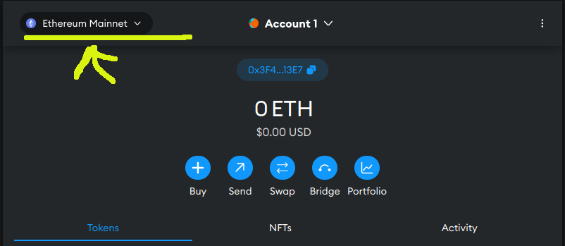
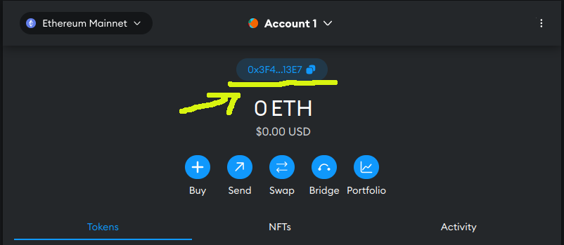
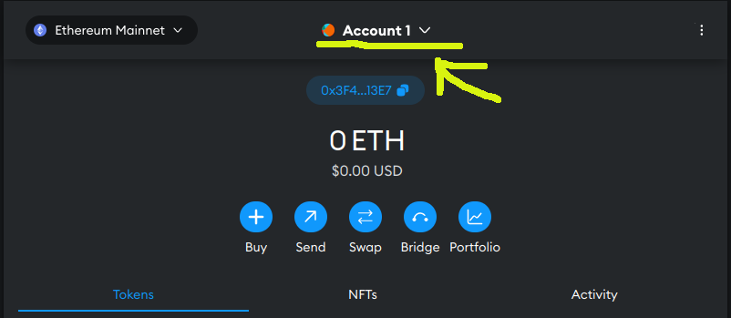
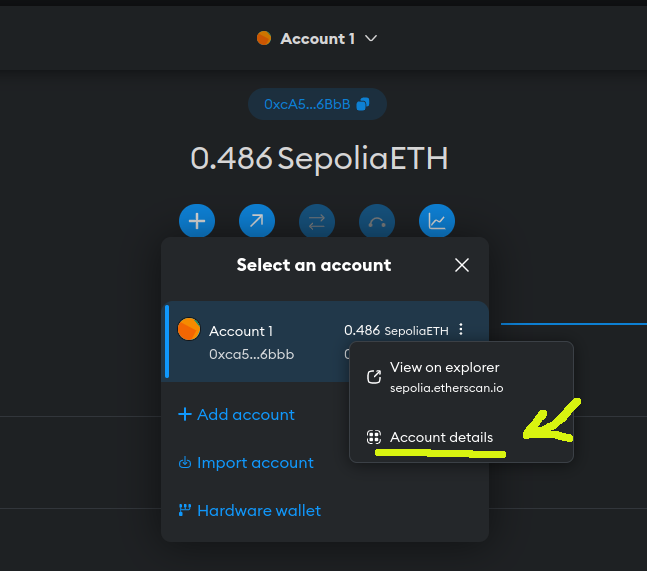

# BarterExchange

## Table of Contents

- [BarterExchange](#BarterExchange)
  - [Table of Contents](#table-of-contents)
  - [Tech Stack](#tech-stack)
    - [Install dependencies](#install-dependencies)
    - [Run project](#run-project)
  - [Keys features](#keys-features)

## Tech Stack

- Thirdweb React this project Vite.js as a frontend framework.
- Tailwind CSS with Vite.js for decorating.
- Hardhat to deploy smart contract.

### Run project

1. go to https://metamask.io/
2. download and install chrom extention
3. Click on *I agree ...* and then create new wallet.
4. Click on *I agree*
5. Create password and and confirmation and click on **Create a new wallet**
6. Watch the video, and then click **Secure my wallet**.
7. Click **Reveal Secret Recovery Phrase.**
8. Save 12 words somewhere
9. fill security question
10. Now the wallet is created
11. Open the  MetaMask page.
12. Click on **Ethereum Mainnet**

13. Enable **Show test networks**
14. Click on **Sepolia**
15. Copy the wallet key and go to https://sepoliafaucet.com/

16. Log in, enter your key and click **Send Me ETH**
17. After a few seconds a few ETH should be transfered to your account.
18. In MetaMask page, click on **Account 1** then click on 3 dots on right side of the **Accound 1** and click **Account Details**


19. click **Show Private Key**
20. Enter password and copy the private key
21. inside **web3** folder create a **.env** file and fill it with the following 

Note: for this application we need at least 2 user which can be demonstrated  y creating another wallet account.
format:
```
PRIVATE_KEY={COPIED_PRIVATE_KEY}
```
22. you have to create an api key in thirdweb.com. connect you wallet. got to `Home` and create APIKey.
23. Inside **web3** directory 
```
npm install
npm run deploy
```
24. if asked for APIKey enter the created API key.
25. In this step after successful deploy you have to see a link in the command line
26. Open the link  and go to the ThirdWeb website
27. Click **connect wallet** (if not connected before)
28. Click **Deploy Now** keep eye on notification in MetaMask's extension (you probably need to click 2 times on **Config**), this will take a several seconds.
29. in the ThirdWeb website in the **contracts** menu you should be able to see you contract (CharityFund). copy the contract address.
30. go to `client` folder in the `src/context/index.jsx` in line 10 replace your contract address with the existing one.
31. in clinet folder run
```
npm install
npm run dev
```
32. open the browser using the given link in the terminal and now try to **connect** and create charity campaign or donate exisiting ones.


## Keys features

1. **publishAsset:** Create an asset
2. **removeAsset:** Remove an asset
3. **fetchAssets:** Get Assets
4. **requestForExchange:** request for exchange between one of our item with one of the other's
5. **acceptExchange:** Accept the exchange
6. **requestForWithdraw:** withdraw the exchange
7. **getOffers:** get all the offers